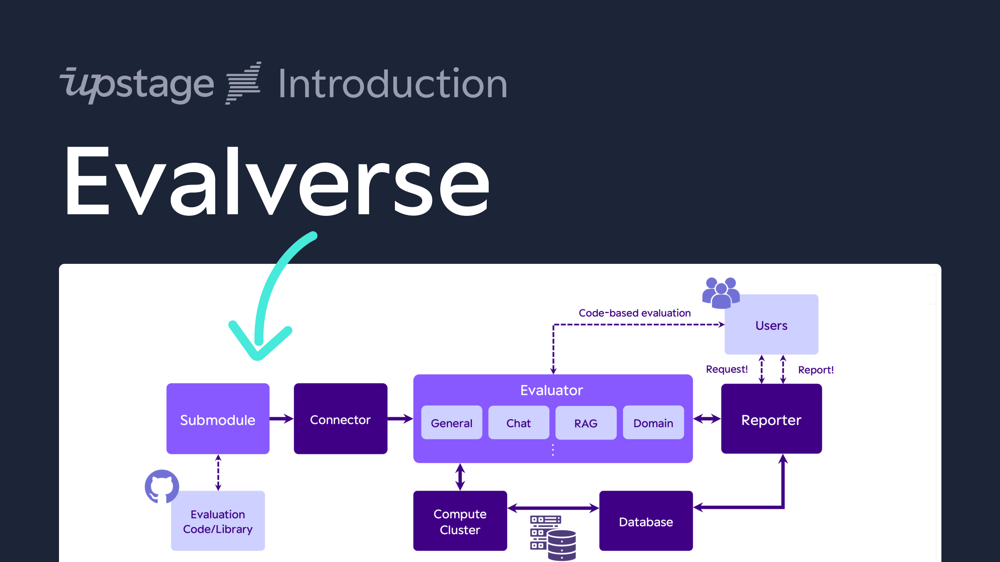

<div align="center">
<picture>
  <source media="(prefers-color-scheme: dark)" srcset="assets/Evalverse_White.png" width=300>
  <source media="(prefers-color-scheme: light)" srcset="assets/Evalverse_Color.png" width=300>
  
</picture>

The Universe of Evaluation.
All about the evaluation for LLMs.  </br>
Upstage Solar is powered by Evalverse! Try at Upstage [Console](https://console.upstage.ai/)!

[Docs](https://evalverse.gitbook.io/evalverse-docs) • [Examples](https://github.com/UpstageAI/evalverse/tree/main/examples) • [FAQ](https://evalverse.gitbook.io/evalverse-docs/documents/faqs) • [Contribution Guide](https://github.com/UpstageAI/evalverse/blob/main/contribution/CONTRIBUTING.md)  • [Contact](mailto:evalverse@upstage.ai)  • [Discord](https://discord.gg/D3bBj66K) • [Paper](https://arxiv.org/abs/2404.00943)
</div>

<div align="center"></div>


## Welcome to Evalverse!
Evalverse is a freely accessible, open-source project designed to support your LLM (Large Language Model) evaluation needs. We provide a simple, standardized, and user-friendly solution for the processing and management of LLM evaluations, catering to the needs of AI research engineers and scientists. We also support no-code evaluation processes for people who may have less experience working with LLMs. Moreover, you will receive a well-organized report with figures summarizing the evaluation results.

### With Evalverse, you are empowered to
- access various evaluation methods without the juggling multiple libraries.
- receive insightful report about the evaluation results that helps you to compare the varied scores across different models.
- initiate evalutions and generate reports without any code via Slack bot.


### Architecture of Evalverse
<div align="center"></div>

### Key Features of Evalverse
- **Unified evaluation with Submodules**: Evalverse extends its evaluation capabilities through Git submodules, effortlessly incorporating frameworks like [lm-evaluation-harness](https://github.com/EleutherAI/lm-evaluation-harness) and [FastChat](https://github.com/lm-sys/FastChat). Swiftly add new tools and keep pace with the latest in LLM evaluation.
- **No-code evaluation request**: With Evalverse, request LLM evaluations without any code, simply by sending `Request!` in a direct message or Slack channel with an activate Evalverse Slack bot. Enter the model name in the Huggingface hub or local model directory path in Slack, and let the bot handle the rest.
- **LLM evaluation report**: Obtain comprehensive, no-code reports from Evalverse. Request with a simple command -`Report!`-, select the model and evaluation criteria, and receive detailed reports with scores, rankings, and visuals, all generated from the stored score database.


If you want to know more about Evalverse, please checkout our [docs](https://evalverse.gitbook.io/evalverse-docs). </br>
By clicking below image, it'll take you to a short intro video!
[](https://www.youtube.com/watch?v=-VviAutjpgM)
</br>

## 🌌 Installation
### 🌠 Option 1: Git clone
Before cloning, please make sure you've registered proper SSH keys linked to your GitHub account.

#### 1. Clone the Evalverse repository
- Notes: add `--recursive` option to also clone submodules
```
git clone --recursive https://github.com/UpstageAI/evalverse.git
```
#### 2. Install requirement packages
```
cd evalverse
pip install -e .
```

### 🌠 Option 2: Install via Pypi *(WIP)*
> Currently, installation via Pypi is not supported. Please install Evalverse with option 1.


</br>

## 🌌 Configuration
You have to set an API key and/or Token in the `.env` file (rename `.env_sample` to `.env`) to use all features of Evalverse.
- OpenAI API Key (required for `mt_bench`)
- Slack BOT/APP Token (required for slack reporter)
```
OPENAI_API_KEY=sk-...

SLACK_BOT_TOKEN=xoxb-...
SLACK_APP_TOKEN=xapp-...
```

</br>

## 🌌 Quickstart
More detailed tutorials are [here](https://github.com/UpstageAI/evalverse/tree/main/examples).

- [basic_usage.ipynb](https://github.com/UpstageAI/evalverse/tree/main/examples/01_basic_usage.ipynb): Very basic usage, like how to use `Evaluator` for evaluation and `Reporter` for generating report.
- [advanced_usage.ipynb](https://github.com/UpstageAI/evalverse/tree/main/examples/02_advanced_usage.ipynb): Introduces methods for evaluating each benchmark and all benchmarks collectively.

### 🌠 Evaluation
#### 💫 Evaluation with Library
The following code is a simple example to evaluate the [SOLAR-10.7B-Instruct-v1.0 model](https://huggingface.co/upstage/SOLAR-10.7B-Instruct-v1.0) on the `h6_en` ([Open LLM Leaderboard](https://huggingface.co/spaces/HuggingFaceH4/open_llm_leaderboard)) benchmark.

```python
import evalverse as ev

evaluator = ev.Evaluator()

model = "upstage/SOLAR-10.7B-Instruct-v1.0"
benchmark = "h6_en"

evaluator.run(model=model, benchmark=benchmark)
```


#### 💫 Evaluation with CLI
Here is a CLI script that produces the same result as the above code:

```bash
cd evalverse

python3 evaluator.py \
  --h6_en \
  --ckpt_path upstage/SOLAR-10.7B-Instruct-v1.0
```
### 🌠 Report
Currently, generating a report is only available through the library. We will work on a Command Line Interface (CLI) version as soon as possible.

```python
import evalverse as ev

db_path = "./db"
output_path = "./results"
reporter = ev.Reporter(db_path=db_path, output_path=output_path)

reporter.update_db(save=True)

model_list = ["SOLAR-10.7B-Instruct-v1.0", "Llama-2-7b-chat-hf"]
benchmark_list = ["h6_en"]
reporter.run(model_list=model_list, benchmark_list=benchmark_list)
```


|                     Model | Ranking | total_avg | H6-ARC | H6-Hellaswag | H6-MMLU | H6-TruthfulQA | H6-Winogrande | H6-GSM8k |
|--------------------------:|--------:|----------:|-------:|-------------:|--------:|--------------:|--------------:|---------:|
| SOLAR-10.7B-Instruct-v1.0 |       1 |     74.62 |  71.33 |        88.19 |   65.52 |         71.72 |         83.19 |    67.78 |
|        Llama-2-7b-chat-hf |       2 |     53.51 |  53.16 |        78.59 |   47.38 |         45.31 |         72.69 |    23.96 |

</br>

## 🌌 Supported Evaluations
We currently support four evaluation methods. If you have suggestions for new methods, we welcome your input!

| Evaluation                | Original Repository                        |
|---------------------------|--------------------------------------------|
| H6 (Open LLM Leaderboard) | [EleutherAI](https://github.com/EleutherAI)/[lm-evaluation-harness](https://github.com/EleutherAI/lm-evaluation-harness)|
| MT-bench                  | [lm-sys](https://github.com/lm-sys)/[FastChat](https://github.com/lm-sys/FastChat)|
| IFEval                    | [google-research](https://github.com/google-research/google-research/tree/master)/[instruction_following_eval](https://github.com/google-research/google-research/tree/master/instruction_following_eval)|
| EQ-Bench                  | [EQ-bench](https://github.com/EQ-bench)/[EQ-Bench](https://github.com/EQ-bench/EQ-Bench)|

</br>

## 🌌 Evalverse use-case
> If you have any use-cases of your own, please feel free to let us know. </br>We would love to hear about them and possibly feature your case.


*✨* [`Upstage`](https://www.upstage.ai/) is using Evalverse for evaluating [Solar](https://console.upstage.ai/services/solar?utm_source=upstage.ai&utm_medium=referral&utm_campaign=Main+hero+Solar+card&utm_term=Try+API+for+Free&utm_content=home). </br>
*✨* [`Upstage`](https://www.upstage.ai/) is using Evalverse for evaluating models at [Open Ko-LLM Leaderboard](https://huggingface.co/spaces/upstage/open-ko-llm-leaderboard).

</br>

## 🌌 Contributors
<a href="https://github.com/UpstageAI/evalverse/graphs/contributors">
  
</a>


## 🌌 Acknowledgements
Evalverse is an open-source project orchestrated by the **Data-Centric LLM Team** at `Upstage`, designed as an ecosystem for LLM evaluation. Launched in April 2024, this initiative stands at the forefront of advancing evaluation handling in the realm of large language models (LLMs).

## 🌌 License
Evalverse is completely freely-accessible open-source and licensed under the Apache License 2.0.

## 🌌 Citation
If you want to cite our 🌌 Evalverse project, feel free to use the following bibtex. You can check our paper via [link](https://arxiv.org/abs/2404.00943).

```bibtex
@misc{kim2024evalverse,
      title={Evalverse: Unified and Accessible Library for Large Language Model Evaluation}, 
      author={Jihoo Kim and Wonho Song and Dahyun Kim and Yunsu Kim and Yungi Kim and Chanjun Park},
      year={2024},
      eprint={2404.00943},
      archivePrefix={arXiv},
      primaryClass={cs.CL}
}
```
